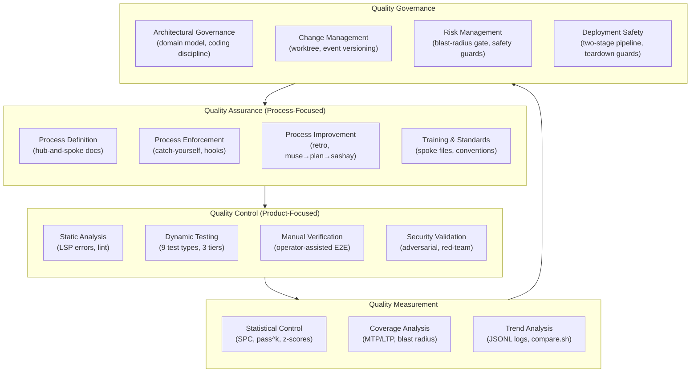

# Quality Framework: AI-Assisted Software Engineering

> **⚠ AI-generated, no human review.** This analysis was written by an AI language model. No human has verified the claims, checked the source material citations, or reviewed the reasoning. Treat it as a starting point for your own investigation.

## Analysis of the `~/.agents/AGENTS.md` Hub-and-Spoke Quality Controls

**Date:** 2026-07-07
**Scope:** Global agent instruction framework (`~/.agents/AGENTS.md` and all spoke files under `~/.agents/agents-md-detail/`)
**Method:** Map each quality control to industry-standard practices from software engineering (ISO 25010, IEEE 829, ISTQB, CI/CD quality gates) and manufacturing (Six Sigma, TQM, SPC, ISO 9001), then identify coverage and gaps from the "textbook complete" perspective.

---

## Table of Contents

1. [Executive Summary](#executive-summary)
2. [Quality Controls Inventory](#quality-controls-inventory)
3. [Industry Standards Reference](#industry-standards-reference)
4. [Coverage Mapping: Framework vs. Industry](#coverage-mapping-framework-vs-industry)
5. [Gap Analysis: The Textbook QA/QC Perspective](#gap-analysis-the-textbook-qaqc-perspective)
6. [Manufacturing Analogues](#manufacturing-analogues)
7. [Recommendations](#recommendations)

---

## Executive Summary

The `~/.agents/AGENTS.md` framework implements a quality control system for AI-assisted software engineering. It covers 18 quality control dimensions spanning test discipline, error handling, architectural governance, deployment safety, and agent behavior. When mapped against industry standards, the framework shows **strong coverage** in test-driven development, debugging discipline, and deployment safety, **moderate coverage** in static analysis and architectural governance, and **gaps** in quantitative measurement, formal review processes, and requirements traceability.

The framework's quality contribution is its **behavioral quality controls**, rules that govern how the AI agent itself behaves (fail-loud, no coercion, test-first, catch-yourself-before-you-fix). These have no direct analogue in traditional software QA but map conceptually to manufacturing's "poka-yoke" (mistake-proofing) and standard work instructions.

---

## Quality Controls Inventory

The following inventory catalogs every quality control mechanism found in the hub-and-spoke framework, organized by spoke file.

### 1. Test-Driven Design (`test-driven-design.md`)

| Control | Mechanism | Type |
|----------|-----------|------|
| Test-first for defects | Write failing test before any fix | Process gate |
| Inverse-assertion requirement | Every suite must include failure-expectation tests | Coverage requirement |
| Required test coverage table | 9 test types, none optional (unit, integration, behavioral, UAT, smoke, E2E, adversarial, red-team, penetration) | Coverage requirement |
| Pre-test inventory (MTP/LTP) | Master Test Plan + Level Test Plan with 3D coverage matrix (workflow paths × coverage classes × blast radius) | Planning gate |
| Blast-radius gate | Binary gate: paths touching Safety/Security/Financial/Privacy/Availability/Integrity require beyond-happy-path coverage | Risk-based gating |
| RGR cycle enforcement | Tests must always execute; missing prereqs = Red, not skip | Honesty requirement |
| Test tier system | Tier 0 (unit/lint), Tier 1 (integration), Tier 2 (staging E2E) with declared commands | Infrastructure requirement |
| Non-deterministic testing protocol | pass^k metric, structured JSONL logging, session-enriched format, ratio guidance | Statistical rigor |
| Speed guidelines | Build once, parallelize, flag >60s suites | Performance requirement |
| Language-specific patterns | Go, Python, TypeScript, Rust, C#, Shell conventions | Standardization |

### 2. Debugging Ritual (`debugging-ritual.md`)

| Control | Mechanism | Type |
|----------|-----------|------|
| 8-step ritual | Reproduce → write failing test → isolate root cause → additional tests → implement fix → verify → full suite → commit | Process gate |
| Catch-yourself-before-you-fix | Trigger-word detection to prevent skipping test step | Behavioral guard |
| No rationalizing test failures | Test failure is a test failure, no euphemisms | Behavioral guard |
| Binary search (git bisect) | Regression isolation technique | Tooling |
| Assertions over print statements | Document assumptions as executable checks | Practice standard |
| Reproduce in isolation | Minimize confounding factors | Practice standard |
| Check the obvious first | Input validation, error handling, race conditions, environment | Practice standard |

### 3. Fail Loud; Never Coerce (`fail-loud-never-coerce.md`)

| Control | Mechanism | Type |
|----------|-----------|------|
| Validate at boundaries | Reject bad input at entry point with named error | Input validation |
| No silent fallbacks | Missing data surfaces as error, never guessed | Error handling |
| No bare except / catch-all | Only logging + re-raise or domain-specific wrapping allowed | Error handling |
| Crash-over-corruption | Prefer loud failure over silent wrongness | Behavioral principle |
| Language-specific patterns | Python, TypeScript, Go, Rust, Shell examples | Standardization |

### 4. Warnings and Deprecations (`warnings-and-deprecations.md`)

| Control | Mechanism | Type |
|----------|-----------|------|
| Three-category triage | Actionable (fix now), Deferred Actionable (plan + suppress), Not Actionable (suppress + document) | Issue management |
| Suppression requires plan | Deferred suppression must reference a `docs/plans/` file | Traceability |
| Noisy-test discipline | Write tests before attempting fixes | Process gate |
| Universal scope | Applies to all tools in the stack | Coverage requirement |

### 5. Coding Discipline (`coding-discipline.md`)

| Control | Mechanism | Type |
|----------|-----------|------|
| Domain model alignment | Changes must respect bounded contexts and ubiquitous language | Architectural governance |
| Single source of truth | No duplication; canonical sources for config, schema, logic, routing | DRY enforcement |
| YAGNI ladder | 5-rung decision framework (hard-code → parameterize → abstract → plugin → language) | Design governance |
| Verification checklist | 3-question pre-edit check | Process gate |

### 6. Operator-Assisted E2E/UAT (`operator-assisted-e2e.md`)

| Control | Mechanism | Type |
|----------|-----------|------|
| YAML test suite format | Structured schema with id, title, steps, preconditions, criticality | Documentation standard |
| State machine | DRAFT → READY → IN_PROGRESS → PASSED/FAILED/BLOCKED/SKIPPED → RETEST | Process model |
| Interactive execution protocol | Per-step operator prompts with p/f/b/s responses | Process gate |
| Report generation | Structured markdown reports with evidence collection | Documentation standard |
| Test-first mandate | YAML test case committed alongside fix | Process gate |
| Retest loop | Blocker vs. standard failure handling | Process gate |
| Evidence collection | Auto-capture terminal output, prompt for screenshots, operator notes | Audit trail |

### 7. LSP Errors (`lsp-errors.md`)

| Control | Mechanism | Type |
|----------|-----------|------|
| Pre-existing error triage | Minor (fix now) vs. significant (tech debt entry) | Issue management |
| Tech debt lifecycle | Discovery → conversion to plan → deletion → index | Traceability |
| Running index | INDEX.md with git ref for retrieval | Audit trail |
| LSP config requirements | Per-language config file requirements | Infrastructure requirement |

### 8. Two-Stage Pipelines (`two-stage-pipelines.md`)

| Control | Mechanism | Type |
|----------|-----------|------|
| Mandatory staging target | Every project must have staging + production | Infrastructure requirement |
| Well-known script paths | `scripts/staging/{setup,deploy,e2e,teardown}.sh` | Standardization |
| Setup output contract | Pass/fail + item name on stdout | Observability |
| Teardown safety guards | Name check + "staging" substring before destroy | Safety gate |
| Branch name sanitization | RFC 1123 label rules via `slugify-branch` | Input validation |
| Cost budget gate | Deterministic reconciliation against provider state | Financial control |
| SPC fitness functions | z-score anomaly detection on deploy duration, resource count, errors, cost | Statistical control |
| Project-local E2E spoke | `.agents/agents-md-detail/staging-e2e.md` per project | Documentation standard |

### 9. Event Contracts (`event-contracts.md`)

| Control | Mechanism | Type |
|----------|-----------|------|
| YAML spec per event | Meta-schema validation with required fields | Schema enforcement |
| Validation script | `check-jsonschema` against meta-schema | Automated check |
| Drift detection (planned) | Scan implementation code for matching classes/structs | Planned |
| Versioning | Monotonically increasing version, since/deprecated fields | Change management |
| Scalar shorthand | Type tokens for payload fields | Standardization |

### 10. Context Map & Domain Model (`context-map-domain-model.md`)

| Control | Mechanism | Type |
|----------|-----------|------|
| Mandatory living artifacts | Context Map and Domain Model under `docs/` | Documentation requirement |
| Two-zoom model | L1 (prose glossary for domain experts) + L2 (ERDs for developers) | Accessibility |
| Bounded context leaves | Per-context README.md with internal events | Documentation standard |
| Discipline rule | Agent must ensure artifacts exist and are current before coding | Process gate |
| Mermaid verification | `mmdc` validation before commit | Automated check |

### 11. New Project Scaffolding (`new-project-scaffolding.md`)

| Control | Mechanism | Type |
|----------|-----------|------|
| Standardized directory layout | Two-surface docs tree, well-known paths | Standardization |
| Mandatory files | AGENTS.md, PURPOSE.md, README.md, CHANGELOG.md, .gitignore | Documentation requirement |
| LSP config files | Per-language config created at scaffold time | Infrastructure requirement |
| Git LFS rules | Binary file types + 50MB size limit | Infrastructure requirement |
| No credential.helper in repo config | Prevents clearing global credential cascade | Security guard |

### 12. Todo List Discipline (`todo-discipline.md`)

| Control | Mechanism | Type |
|----------|-----------|------|
| Native array requirement | `todos` must be bare array, never stringified | Input validation |
| Cross-agent schema reference | OpenCode vs. Claude Code (legacy/new) field differences | Compatibility |
| Common mistakes catalog | Stringified JSON, wrong schema, missing fields, stale state | Training/guidance |

### 13. Mermaid.js Usage (`mermaid-usage.md`)

| Control | Mechanism | Type |
|----------|-----------|------|
| Mermaid-first preference | Use Mermaid before ASCII art | Standardization |
| Validation before commit | `mmdc -i <file> -o /tmp/diagram.png` must succeed | Automated check |
| Self-check for box-drawing | Agent must stop and reconsider if outputting box-drawing chars | Behavioral guard |

### 14. Worktree Discipline (`worktree-discipline.md`)

| Control | Mechanism | Type |
|----------|-----------|------|
| Root on main/trunk only | All other branches in `.worktrees/` | Branching policy |
| Pre-checkout hook | Blocks non-main checkout in root | Automated enforcement |
| Override mechanism | `SKIP_WORKTREE_CHECK=1` for emergencies | Escape hatch |

### 15. Subagent Delegation (`subagent-delegation.md`)

| Control | Mechanism | Type |
|----------|-----------|------|
| Weight-based model selection | Heavy/medium/light classification | Resource governance |
| No heavy without explicit marking | Prevents over-provisioning | Cost control |

### 16. Overnight Autonomy (`overnight-autonomy.md`)

| Control | Mechanism | Type |
|----------|-----------|------|
| State machine | idle → nudging → autonomous → done | Process model |
| Plan-before-execute | Work queue, boundaries, failure handling, morning artifacts | Planning gate |
| Self-deleting cleanup | One-shot launchd/systemd timer at 7am | Infrastructure |
| Morning briefing | Structured markdown report | Documentation standard |

### 17. Tool Usage (`tool-usage.md`)

| Control | Mechanism | Type |
|----------|-----------|------|
| Broken tool rule | Never use broken tool to diagnose itself | Diagnostic discipline |
| Date/time bookending | Echo datetime before and after every tool invocation | Observability |
| Tool-specific conventions | 1Password batching, shell file ops, Python uv-only, git no-verify gate | Standardization |

### 18. Workflow Rituals (`workflow-rituals.md`)

| Control | Mechanism | Type |
|----------|-----------|------|
| Named protocols | Sashay, Jam, Parley, Retro, Make Fair, Sitrep, Muse, EDA | Process model |
| Trigger-based routing | Keyword match → read spoke → apply protocol | Process gate |
| Must-read-before-act | No acting from memory alone | Behavioral guard |

### 19. Agent Testing (`agent-testing.md`)

| Control | Mechanism | Type |
|----------|-----------|------|
| Orchestration integration tests | Deterministic tests for dispatch, lock-watch, cleanup | Test type |
| Skill behavioral contracts | YAML contract with intents, tools, output schema, failure modes | Specification |
| Adversarial input testing | Prompt injection, out-of-scope, tool misuse, role confusion | Security testing |
| MCP server integration tests | Server-level (deterministic) + model-integration (non-deterministic) | Test type |
| Structured output contracts | JSON schema for agent output validation | Schema enforcement |

### 20. Cove (`cove.md`)

| Control | Mechanism | Type |
|----------|-----------|------|
| Offline-first constraint | No cloud dependencies, no internet during builds/CI | Infrastructure constraint |
| Secret management | `cove creds vault-get/vault-put`, never hardcode | Security guard |
| Git remote convention | `origin` for primary, named remotes (`fj`, `gh`, `gl`) for others | Standardization |

---

## Industry Standards Reference

### Software Engineering Standards

#### ISO/IEC 25010 (SQuaRE Quality Model)

Eight quality characteristics with 31 sub-characteristics:

| Characteristic | Sub-characteristics |
|----------------|---------------------|
| Functional Suitability | Completeness, Correctness, Appropriateness |
| Performance Efficiency | Time behavior, Resource utilization, Capacity |
| Compatibility | Co-existence, Interoperability |
| Usability | Appropriateness recognizability, Learnability, Operability, User error protection, UI aesthetics, Accessibility |
| Reliability | Maturity, Availability, Fault tolerance, Recoverability |
| Security | Confidentiality, Integrity, Non-repudiation, Accountability, Authenticity |
| Maintainability | Modularity, Reusability, Analysability, Modifiability, Testability |
| Portability | Adaptability, Installability, Replaceability |

#### IEEE 829-2008 (Test Documentation)

Standard for test documentation structure: Test Plan, Test Design Specification, Test Case Specification, Test Procedure Specification, Test Log, Test Incident Report, Test Summary Report.

#### ISTQB (International Software Testing Qualifications Board)

Test levels: Unit, Integration, System, Acceptance. Test types: Functional, Non-functional, Structural, Regression. Test process: Planning, Analysis & Design, Implementation & Execution, Evaluation & Reporting, Closure.

#### ISO/IEC 29119 (Software Testing)

Five-part standard: Concepts & Definitions, Test Processes, Test Documentation, Test Techniques, Keyword-Driven Testing.

#### CI/CD Quality Gates (Industry Practice)

Standard gates in modern pipelines:
1. Static Analysis & Code Quality (linting, complexity, duplication)
2. Unit & Integration Test Success
3. Security Vulnerability & Dependency Scan
4. Artifact Integrity Check (signing, checksums)
5. Configuration & Infrastructure Validation (IaC linting)
6. End-to-End Test Suite
7. Performance & Load Testing
8. Monitoring & Logging Check
9. Rollback Readiness & Health Check
10. DORA Metrics Threshold Check

### Manufacturing Quality Standards

#### ISO 9001:2015 (Quality Management Systems)

Seven principles: Customer focus, Leadership, Engagement of people, Process approach, Improvement, Evidence-based decision making, Relationship management.

Core components: Quality Planning → Quality Assurance → Quality Control → Quality Improvement (PDCA cycle).

#### Six Sigma (DMAIC)

Define → Measure → Analyze → Improve → Control. Target: 3.4 defects per million opportunities (DPMO). Key tools: SPC, FMEA, DOE, Pareto analysis, Ishikawa diagrams, 5 Whys.

#### Total Quality Management (TQM)

Organization-wide culture of continuous improvement. Principles: Customer focus, Total employee involvement, Process-centered, Integrated system, Strategic approach, Continual improvement, Fact-based decisions, Communications.

#### Statistical Process Control (SPC)

Control charts monitoring process variation. Western Electric / Nelson rules for anomaly detection (3σ threshold). Process capability indices (Cp, Cpk).

#### Poka-Yoke (Mistake-Proofing)

Design processes so errors are impossible or immediately detectable. Three types: Contact method (physical attributes), Fixed-value method (count/sequence), Motion-step method (process steps).

---

## Coverage Mapping: Framework vs. Industry

### Software Engineering Coverage

| Industry Practice | Framework Coverage | Strength |
|-------------------|-------------------|----------|
| **Test Planning (IEEE 829)** | MTP/LTP with 3D coverage matrix | **Strong**, exceeds IEEE 829 with blast-radius gating and sashay delta procedure |
| **Test Levels (ISTQB)** | 9 required test types + 3-tier system | **Strong**, covers all ISTQB levels plus agent-specific types |
| **Test-First (TDD)** | Mandatory test-before-fix, catch-yourself triggers | **Strong**, enforced at behavioral level, not just policy |
| **Static Analysis** | LSP error handling, lint violations, tech debt tracking | **Moderate**, reactive (fixes pre-existing errors) rather than proactive gating |
| **Code Review** | Coding discipline checklist, YAGNI ladder | **Weak**, no formal review process; relies on agent self-discipline |
| **CI/CD Quality Gates** | Two-stage pipeline with setup/deploy/e2e/teardown scripts | **Strong**, staging gate with SPC fitness functions |
| **Security Testing** | Adversarial input testing, prompt injection, red-team, penetration tests | **Strong**, agent-specific adversarial corpus requirement |
| **Performance Testing** | Speed guidelines (>60s flag), SPC latency monitoring | **Moderate**, guidelines only, no load/stress testing requirement |
| **Requirements Traceability** | Event contracts with versioning, domain model discipline | **Moderate**, event-level traceability, no requirement-to-test matrix |
| **Test Documentation (IEEE 829)** | YAML test suites, structured reports, JSONL logging | **Strong**, machine-parseable formats exceed IEEE 829 |
| **Defect Management** | Debugging ritual, tech debt lifecycle, warning triage | **Strong**, full lifecycle from discovery to fix to regression protection |
| **Configuration Management** | Worktree discipline, branch sanitization, LSP config requirements | **Strong**, enforced at hook level |
| **Non-Deterministic Testing** | pass^k metric, session-enriched JSONL, ratio guidance | **Strong**, novel contribution beyond industry standards |
| **Observability** | Date/time bookending, SPC fitness functions, structured logging | **Moderate**, agent-level observability, no application-level requirement |
| **Disaster Recovery** | Teardown safety guards, rollback readiness (implied) | **Moderate**, staging safety, no production DR plan requirement |

### ISO 25010 Quality Characteristics Coverage

| Characteristic | Framework Coverage |
|----------------|-------------------|
| Functional Suitability | **Strong**, test-first, inverse assertions, behavioral contracts |
| Performance Efficiency | **Weak**, speed guidelines only, no formal performance requirements |
| Compatibility | **Weak**, no explicit compatibility testing requirement |
| Usability | **Moderate**, operator-assisted UAT, but no usability-specific testing |
| Reliability | **Strong**, RGR cycle, no-skip enforcement, SPC monitoring, fault tolerance via fail-loud |
| Security | **Strong**, adversarial testing, secret management, prompt injection defense |
| Maintainability | **Strong**, coding discipline, YAGNI ladder, single source of truth, tech debt lifecycle |
| Portability | **Weak**, no explicit portability testing requirement |

### Manufacturing Analogues Coverage

| Manufacturing Practice | Framework Analogue | Coverage |
|------------------------|-------------------|----------|
| **Six Sigma DMAIC** | Debugging Ritual (Define=reproduce, Measure=test, Analyze=root cause, Improve=fix, Control=regression test) | **Strong** |
| **SPC (Control Charts)** | SPC fitness functions in two-stage pipelines (z-score, 3σ threshold) | **Strong** |
| **Poka-Yoke (Mistake-Proofing)** | Catch-yourself triggers, pre-checkout hook, teardown safety guards, todo schema enforcement | **Strong** |
| **TQM (Continuous Improvement)** | Retro ritual, tech debt lifecycle, warning triage, plan conversion | **Strong** |
| **ISO 9001 QMS** | Hub-and-spoke documentation structure, mandatory artifacts, process approach | **Moderate**, documented but not audited |
| **FMEA (Failure Mode Analysis)** | Blast-radius gate, adversarial testing, inverse assertions | **Strong** |
| **5S (Workplace Organization)** | Worktree discipline, standardized directory layout, well-known paths | **Strong** |
| **Kaizen (Incremental Improvement)** | Muse → plan → sashay pipeline, retro → next actions | **Strong** |
| **Andon (Stop-the-Line)** | Fail-loud principle, no silent fallbacks, crash-over-corruption | **Strong** |
| **Jidoka (Autonomation)** | Overnight autonomy with boundaries and failure handling | **Moderate** |

---

## Gap Analysis: The Textbook QA/QC Perspective

This section starts from the "textbook complete" perspective, what a full QA/QC system would include, and identifies where the framework has coverage and where gaps exist.

### Software Engineering QA/QC, Textbook Model

A "textbook complete" software QA/QC system, drawing from ISO 25010, IEEE 829, ISTQB, ISO 29119, and modern DevOps practices, would include:

#### 1. Quality Planning

| Element | Coverage | Notes |
|---------|----------|-------|
| Quality policy | **Absent** | No explicit quality policy statement |
| Quality objectives (measurable) | **Absent** | No quantitative quality targets (e.g., "≤3.4 defects/KLOC") |
| Quality plan per project | **Partial** | MTP/LTP provides test planning but not full quality planning |
| Stakeholder quality expectations | **Absent** | No mechanism to capture stakeholder quality requirements |
| Risk-based test prioritization | **Strong** | Blast-radius gate with 6 universal risk categories |

#### 2. Quality Assurance (Process-Focused)

| Element | Coverage | Notes |
|---------|----------|-------|
| Process definition and documentation | **Strong** | Hub-and-spoke framework is full process documentation |
| Process compliance auditing | **Absent** | No audit mechanism, relies on agent self-enforcement |
| Process improvement (PDCA) | **Strong** | Retro ritual, muse → plan → sashay pipeline |
| Training and competency | **Partial** | Spoke files serve as training, but no competency verification |
| Supplier quality management | **Absent** | No vendor/supplier quality requirements |
| Preventive action | **Strong** | Fail-loud, catch-yourself, pre-checkout hooks, teardown guards |

#### 3. Quality Control (Product-Focused)

| Element | Coverage | Notes |
|---------|----------|-------|
| Static analysis gate | **Partial** | LSP error handling is reactive; no proactive static analysis gate in CI |
| Unit testing | **Strong** | Mandatory, test-first, inverse assertions required |
| Integration testing | **Strong** | Tier 1, pre-implementation RGR |
| System testing | **Strong** | E2E tests, operator-assisted UAT |
| Acceptance testing | **Strong** | Automated UAT, operator-assisted protocol |
| Regression testing | **Strong** | Full suite run required, debugging ritual step 7 |
| Performance testing | **Weak** | Speed guidelines only; no load/stress/volume testing |
| Security testing | **Strong** | Adversarial, red-team, penetration tests required |
| Usability testing | **Weak** | No explicit usability testing requirement |
| Compatibility testing | **Absent** | No cross-platform/browser/version testing requirement |
| Accessibility testing | **Absent** | No accessibility testing requirement |

#### 4. Test Management

| Element | Coverage | Notes |
|---------|----------|-------|
| Test strategy | **Strong** | Required test coverage table, test tiers |
| Test planning (MTP) | **Strong** | 3D coverage matrix with blast-radius gating |
| Test design techniques | **Partial** | Happy/Sad/Edge/Corner taxonomy; no explicit mention of equivalence partitioning, boundary value analysis, decision tables |
| Test environment management | **Strong** | Two-stage pipelines, staging scripts, tier system |
| Test data management | **Absent** | No test data strategy or data privacy requirements |
| Test automation strategy | **Strong** | Tier system, language-specific patterns, speed guidelines |
| Defect management | **Strong** | Debugging ritual, tech debt lifecycle, warning triage |
| Test metrics and reporting | **Strong** | pass^k, JSONL logging, session-enriched format, report generation |
| Test closure | **Partial** | Sashay closure includes test results; no formal test summary report |

#### 5. Configuration & Change Management

| Element | Coverage | Notes |
|---------|----------|-------|
| Version control discipline | **Strong** | Worktree discipline, branch sanitization |
| Change impact analysis | **Strong** | Sashay delta procedure, blast-radius review |
| Release management | **Partial** | Two-stage pipeline; no release versioning or rollback strategy |
| Configuration auditing | **Absent** | No configuration audit requirement |
| Build management | **Partial** | Speed guidelines (build once); no build reproducibility requirement |

#### 6. Measurement & Analysis

| Element | Coverage | Notes |
|---------|----------|-------|
| Quality metrics definition | **Partial** | pass^k, SPC z-scores; no defect density, MTBF, or other standard metrics |
| Data collection | **Strong** | JSONL logging, session-enriched format, evidence collection |
| Statistical analysis | **Strong** | SPC fitness functions, pass^k computation, z-score anomaly detection |
| Trend analysis | **Partial** | Multi-session comparison via `compare.sh`; no long-term trending requirement |
| Management reporting | **Partial** | Morning briefing, test reports; no executive dashboard concept |

#### 7. Reviews and Audits

| Element | Coverage | Notes |
|---------|----------|-------|
| Formal code review | **Absent** | No peer review requirement; relies on agent self-review |
| Technical review | **Partial** | Parley ritual for design decisions; no formal technical review |
| Inspection | **Absent** | No formal inspection process (moderator, reader, recorder roles) |
| Walkthrough | **Partial** | Operator-assisted E2E is a form of walkthrough |
| Audit | **Absent** | No internal or external audit requirement |
| Management review | **Absent** | No management review of quality system |

#### 8. Requirements Engineering

| Element | Coverage | Notes |
|---------|----------|-------|
| Requirements specification | **Partial** | PURPOSE.md, domain model; no formal requirements format |
| Requirements traceability | **Partial** | Event contracts trace producers/consumers; no requirement-to-test matrix |
| Requirements validation | **Absent** | No requirements review or validation process |
| Requirements change management | **Partial** | Event versioning; no general requirements change process |

### Manufacturing QA/QC, Textbook Model

A "textbook complete" manufacturing QA/QC system, drawing from ISO 9001, Six Sigma, TQM, and Lean, would include:

#### 1. Quality Management System (ISO 9001)

| Element | Coverage | Notes |
|---------|----------|-------|
| Documented QMS | **Strong** | Hub-and-spoke framework is a documented QMS |
| Quality manual | **Partial** | AGENTS.md is the quality manual; no explicit quality policy |
| Document control | **Strong** | Version-controlled spoke files, hub-and-spoke conventions |
| Record control | **Strong** | JSONL logs, test reports, tech debt index |
| Management responsibility | **Absent** | No management review or responsibility assignment |
| Resource management | **Partial** | Subagent delegation (model weight); no human resource planning |
| Product realization | **Strong** | Sashay pipeline from plan to PR to merge |
| Measurement, analysis, improvement | **Strong** | SPC, pass^k, retro, tech debt lifecycle |

#### 2. Six Sigma Infrastructure

| Element | Coverage | Notes |
|---------|----------|-------|
| Belt system (Champion, Black Belt, Green Belt) | **Absent** | No role-based quality responsibility structure |
| DMAIC methodology | **Strong** | Debugging ritual maps to DMAIC |
| DMADV (Design for Six Sigma) | **Absent** | No design-phase quality methodology |
| Voice of Customer (VOC) | **Absent** | No customer feedback integration |
| CTQ (Critical to Quality) trees | **Partial** | Blast-radius categories approximate CTQs |
| Project charter | **Partial** | Sashay plan approximates project charter |
| Tollgate reviews | **Absent** | No formal phase-gate reviews |

#### 3. Statistical Process Control

| Element | Coverage | Notes |
|---------|----------|-------|
| Control charts (X-bar, R, p, c, u) | **Partial** | SPC z-scores only; no control chart types |
| Process capability (Cp, Cpk) | **Absent** | No process capability indices |
| Western Electric rules | **Strong** | 3σ threshold explicitly referenced |
| Common vs. special cause variation | **Absent** | No distinction between variation types |
| Rational subgrouping | **Absent** | No sampling strategy |

#### 4. Lean Manufacturing

| Element | Coverage | Notes |
|---------|----------|-------|
| Value stream mapping | **Absent** | No value stream analysis |
| 5S (Sort, Set, Shine, Standardize, Sustain) | **Strong** | Worktree discipline, standardized layout, well-known paths |
| Kaizen (continuous improvement) | **Strong** | Retro → next actions, muse → plan → sashay |
| Jidoka (autonomation) | **Moderate** | Overnight autonomy with stop conditions |
| Just-in-Time | **Absent** | Not applicable to knowledge work |
| Poka-yoke (mistake-proofing) | **Strong** | Catch-yourself triggers, pre-checkout hooks, teardown guards |
| Andon (visual management) | **Strong** | Fail-loud, no silent fallbacks |
| Heijunka (production leveling) | **Absent** | No workload leveling mechanism |
| Gemba (go and see) | **Partial** | Operator-assisted E2E is a form of gemba walk |

#### 5. Total Quality Management

| Element | Coverage | Notes |
|---------|----------|-------|
| Customer focus | **Partial** | Domain model captures user needs; no explicit customer feedback loop |
| Total employee involvement | **Absent** | Agent-only framework; no human team involvement structure |
| Process-centered | **Strong** | Workflow rituals, sashay pipeline |
| Integrated system | **Strong** | Hub-and-spoke architecture connects all quality controls |
| Strategic approach | **Partial** | Quality is tactical (per-task); no strategic quality planning |
| Continual improvement | **Strong** | Retro, muse, tech debt lifecycle |
| Fact-based decisions | **Strong** | SPC, pass^k, evidence collection |
| Communications | **Partial** | Morning briefing, sitrep; no stakeholder communication plan |

---

## Summary Gap Matrix

### Critical Gaps (No Coverage)

| Gap | Industry Source | Impact |
|-----|----------------|--------|
| **Formal code/peer review** | IEEE 1028, ISO 29119 | No independent verification of code quality |
| **Performance/load testing requirement** | ISO 25010 (Performance Efficiency) | No guarantee of system performance under load |
| **Requirements traceability matrix** | IEEE 829, CMMI | Cannot verify all requirements are tested |
| **Process auditing** | ISO 9001 | No verification that processes are followed |
| **Test data management** | ISTQB, ISO 29119 | Risk of non-representative or non-compliant test data |
| **Accessibility testing** | ISO 25010 (Usability/Accessibility), WCAG | No accessibility compliance verification |
| **Compatibility testing** | ISO 25010 (Compatibility) | No cross-platform/version verification |
| **Management review** | ISO 9001 | No organizational oversight of quality system |
| **Customer feedback integration** | TQM, Six Sigma (VOC) | Quality system disconnected from end-user experience |
| **Formal inspection process** | IEEE 1028 | No structured defect detection in artifacts |

### Moderate Gaps (Partial Coverage)

| Gap | Current Coverage | Missing |
|-----|-----------------|---------|
| **Static analysis gating** | LSP error handling (reactive) | Proactive CI gate blocking on quality thresholds |
| **Quantitative quality metrics** | pass^k, SPC z-scores | Defect density, MTBF, code churn, DORA metrics |
| **Release management** | Two-stage pipeline | Release versioning, rollback strategy, deployment approval |
| **Requirements specification** | PURPOSE.md, domain model | Formal requirements format, validation process |
| **Test design techniques** | Happy/Sad/Edge/Corner | Equivalence partitioning, boundary value analysis, decision tables |
| **Build reproducibility** | Speed guidelines | Build reproducibility verification, SBOM |
| **Usability testing** | Operator-assisted UAT | Usability-specific test cases, heuristic evaluation |
| **Process capability measurement** | SPC monitoring | Cp, Cpk indices, process baseline establishment |

### Strengths (Exceeds Industry Standard)

| Strength | Why It Exceeds |
|----------|---------------|
| **Behavioral quality controls** | Catch-yourself triggers, no-rationalizing, fail-loud, no industry analogue |
| **Non-deterministic testing protocol** | pass^k metric, session-enriched JSONL, novel contribution |
| **Agent-specific test types** | Adversarial input, skill behavioral contracts, orchestration tests |
| **Blast-radius gating** | Binary risk gate with 6 universal categories, more direct than typical risk matrices |
| **MTP/LTP delta procedure** | Self-healing coverage matrix with drift detection, exceeds static test plans |
| **Poka-yoke integration** | Mistake-proofing woven into agent behavior, not just process documentation |
| **SPC in deployment pipelines** | Statistical anomaly detection in staging, rare in industry practice |

---

## Recommendations

### Immediate (Low Effort, High Impact)

1. **Add a static analysis quality gate**, require lint/type-check to pass before merge (already implied by LSP error handling; make it an explicit gate in the sashay).
2. **Define quantitative quality targets**, adopt DORA metrics (deployment frequency, lead time, MTTR, change failure rate) as project-level quality objectives.
3. **Add a formal review requirement**, for agent-produced code, require at minimum a self-review checklist before PR creation.

### Medium-Term (Moderate Effort)

4. **Implement requirements traceability**, extend the MTP/LTP matrix to include a requirements column, linking workflow paths to PURPOSE.md or ADR entries.
5. **Add performance testing requirements**, for projects touching the Availability risk category, require load/stress testing as part of the test coverage table.
6. **Establish process auditing**, create a periodic "quality system review" ritual that walks the framework and verifies compliance.

### Strategic (Long-Term)

7. **Integrate customer feedback**, add a VOC (Voice of Customer) mechanism to the retro ritual, capturing operator satisfaction and pain points.
8. **Develop process capability baselines**, track Cp/Cpk for key processes (sashay cycle time, defect escape rate) to enable predictive quality.
9. **Create a quality policy statement**, a one-paragraph quality policy in AGENTS.md that sets the tone and measurable objectives for the entire framework.

---

## Appendix A: Quality Control Taxonomy

## Appendix B: Framework-to-ISO 25010 Mapping

| ISO 25010 Characteristic | Framework Spoke(s) | Coverage Level |
|--------------------------|-------------------|----------------|
| Functional Suitability | test-driven-design, debugging-ritual, agent-testing | High |
| Performance Efficiency | test-driven-design (speed guidelines) | Low |
| Compatibility | — | None |
| Usability | operator-assisted-e2e | Low |
| Reliability | test-driven-design (RGR), two-stage-pipelines (SPC), fail-loud-never-coerce | High |
| Security | agent-testing (adversarial), cove (secrets), two-stage-pipelines (teardown guards) | High |
| Maintainability | coding-discipline, lsp-errors, warnings-and-deprecations, context-map-domain-model | High |
| Portability | — | None |

## Appendix C: Framework-to-Manufacturing Analogue Map

| Manufacturing Concept | Framework Analogue | Spoke |
|----------------------|-------------------|-------|
| Poka-Yoke | Catch-yourself triggers, pre-checkout hooks, teardown guards, todo schema enforcement | debugging-ritual, worktree-discipline, two-stage-pipelines, todo-discipline |
| Andon Cord | Fail-loud principle, no silent fallbacks | fail-loud-never-coerce |
| SPC Control Charts | SPC fitness functions (z-score, 3σ) | two-stage-pipelines |
| DMAIC | Debugging ritual (8 steps) | debugging-ritual |
| 5S | Worktree discipline, standardized layout, well-known paths | worktree-discipline, new-project-scaffolding, locations |
| Kaizen | Retro → next actions, muse → plan → sashay | workflow-rituals |
| FMEA | Blast-radius gate, adversarial testing, inverse assertions | test-driven-design, agent-testing |
| Gemba Walk | Operator-assisted E2E/UAT | operator-assisted-e2e |
| Jidoka | Overnight autonomy with stop conditions | overnight-autonomy |
| PDCA Cycle | Muse (Plan) → Sashay (Do) → Test (Check) → Retro (Act) | workflow-rituals |
| Standard Work | Hub-and-spoke conventions, language-specific patterns | All spokes |
| Visual Management | Mermaid diagrams, structured reports, morning briefing | mermaid-usage, operator-assisted-e2e, overnight-autonomy |
