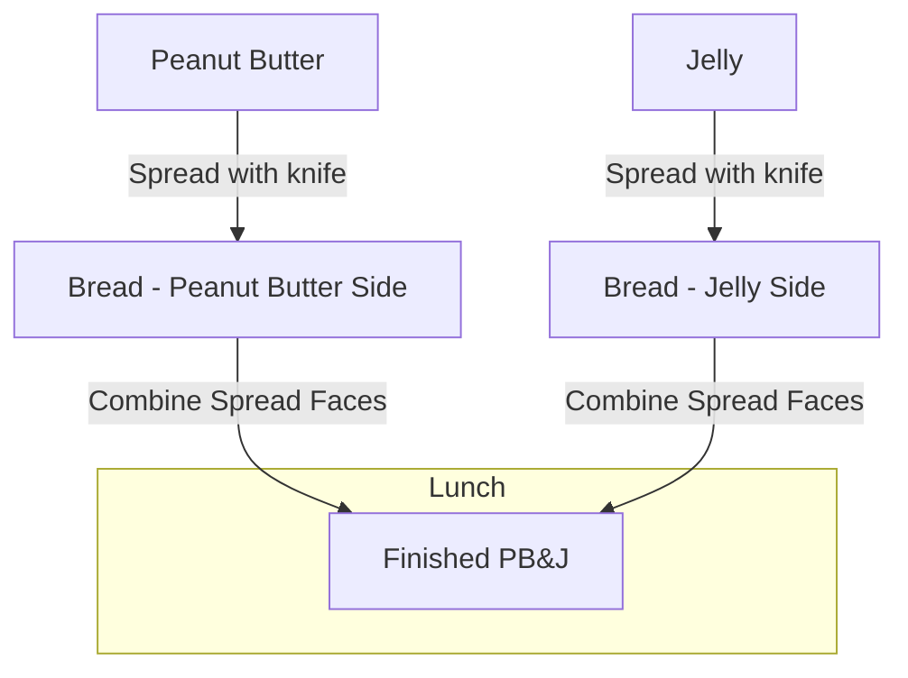

# Mermaid.js Usage

## Diagram preference: Mermaid first, ASCII last

ALWAYS reach for Mermaid.js first when building any kind of flowchart, map, or diagram — state machines, decision trees, architecture overviews, data flow, sequence diagrams, mind maps, gantt charts, pie charts, entity relations, and any other visual structure. Mermaid is the default choice for visual communication in artifacts, docs, plans, ADRs, runbooks, and READMEs.

Use ASCII art / box-drawing charts only as a **last resort**, when one of these is genuinely true:

- Mermaid cannot express the structure (rare — check the [supported diagram types](https://mermaid.js.org/intro/) first).
- The target render context strips or mangles fenced code blocks (e.g. a plain-text email, a terminal-only viewer with no markdown rendering).
- The diagram must be readable inline in a diff or `git log` view where image rendering is impossible AND the consumer cannot click through to a rendered file.
- A single tiny inline arrow sketch (`x --> y`) is shorter than the Mermaid fence overhead and the consumer is already reading prose, not docs.
- **Directory/file trees** (e.g., `tree` command output, filesystem listings) — Mermaid flowcharts are less readable for this structure. Use box-drawing.

A vague preference for "simplicity" or "compatibility" is NOT a reason to skip Mermaid. When in doubt, use Mermaid. If you fall back to ASCII, note the reason in a comment next to the chart so the choice is auditable.

## Validation before commit

All Mermaid diagrams must be verified error-free with `mmdc`. Extract the diagram body (between ` ```mermaid ` and ` ``` `, excluding the fence markers), pipe to a temp file, and run `mmdc -i <file> -o /tmp/diagram.png`. Do not commit any diagram that fails validation.

## Mermaid Flowcharts

ALWAYS use meaningful node names and wrap labels in double-quotes. Example:



## Self-Check: Box-Drawing Output

Whenever the agent outputs box-drawing characters (`─`, `│`, `┌`, `┐`, `└`, `┘`, `├`, `┤`, `┬`, `┴`, `┼`, `▼`, `▲`, `►`, `◄`, `╭`, `╮`, `╰`, `╯`, `╱`, `╲`, `◉`, `●`, `○`, `◆`, `◇`, `■`, `□`, `▸`, `▹`, `▾`, `▿`, `→`, `←`, `↑`, `↓`, `↔`, `↕`, `↗`, `↘`, `↙`, `↖`, `↩`, `↪`, `✓`, `✗`, `✘`, `★`, `☆`, `✦`, `✧`, `※`, `⁂`, `❧`, `☛`, `☞`, `❡`, `⟶`, `⟵`, `⟷`, `⤴`, `⤵`, `⬅`, `➡`, `⬆`, `⬇`, `◀`, `▶`, `▲`, `▼`), it MUST stop and check whether a Mermaid diagram would be more appropriate per the rules above. If Mermaid is the right choice, replace the box-drawing output with a Mermaid fenced block. If box-drawing is genuinely justified (one of the exceptions above), the agent MUST note the reason in a comment next to the chart.

This check applies to all output: musings, plans, ADRs, PR comments, terminal output, and any other artifact.

## Triggers

`mermaid`, `diagram`, `mmdc`, `flowchart`, `sequence diagram`, `graph`, `ASCII chart`, `box-drawing`, `ascii art`.
