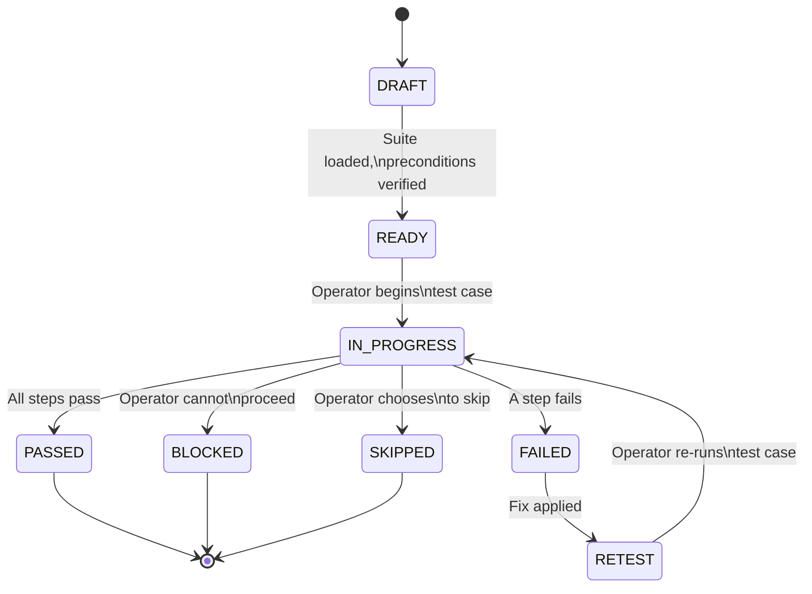

# Operator-Assisted E2E / UAT Protocol

The key words "MUST", "MUST NOT", "REQUIRED", "SHALL", "SHALL NOT", "SHOULD", "SHOULD NOT", "RECOMMENDED", "MAY", and "OPTIONAL" in this document are to be interpreted as described in [RFC 2119](https://www.rfc-editor.org/rfc/rfc2119).

## Relationship to Existing Protocols

This spoke augments the Operator-Assisted E2E Protocol defined in `test-driven-design.md` and the sashay protocol in `workflow-rituals/pr-sashay.md`. The existing protocol in `test-driven-design.md` defines the log format and batching rules; this spoke adds the YAML test suite format, state machine, interactive wizard protocol, and report generation.

**Directory convention update:** `test/operator-e2e/` is superseded by `tests/manual/{e2e,uat}/`. All new operator-assisted test suites MUST be placed under `tests/manual/e2e/` (for end-to-end flows) or `tests/manual/uat/` (for user acceptance testing). Existing suites under `test/operator-e2e/` SHOULD be migrated.

## Test Suite Format (YAML)

Test suites are defined as YAML files. The schema is the source of truth; Given/When/Then language convention in step descriptions is RECOMMENDED but not required.

### Schema

```yaml
test_suite:
  id: string                    # Unique identifier, e.g. "auth-flow-001"
  title: string                 # Human-readable title
  description: string           # What this suite covers
  tags: string[]                # Categorization tags

test_cases:
  - id: string                  # Unique within suite, e.g. "TC-01"
    title: string               # Short description
    criticality: string         # "blocker" | "standard"
    preconditions:
      - string                  # Each precondition as a sentence
    steps:
      - order: integer          # Step sequence number
        instruction: string     # What the operator does
        expected: string        # What should happen
    notes: string               # Optional context for the operator
```

### Example

```yaml
test_suite:
  id: deploy-verify-001
  title: Deployment Verification
  description: Verify that the application deploys and serves traffic correctly
  tags: ["deployment", "smoke", "e2e"]

test_cases:
  - id: TC-01
    title: Application starts and serves health endpoint
    criticality: blocker
    preconditions:
      - Application binary is built and available at ./bin/app
      - Port 8080 is not in use
    steps:
      - order: 1
        instruction: "Run `./bin/app &` to start the application in the background"
        expected: "Process starts without error, PID is printed"
      - order: 2
        instruction: "Run `curl -f http://localhost:8080/health`"
        expected: "HTTP 200 OK response with body containing `{\"status\":\"ok\"}`"
    notes: "If port 8080 is in use, the operator should kill the existing process first"

  - id: TC-02
    title: Application gracefully handles missing config
    criticality: standard
    preconditions:
      - Application binary is built and available at ./bin/app
      - No config file exists at the default path
    steps:
      - order: 1
        instruction: "Run `./bin/app` without a config file"
        expected: "Application exits with a non-zero exit code and prints a descriptive error message"
    notes: ""
```

## State Machine

Each test case follows this state machine:



### State Definitions

| State | Description |
|-------|-------------|
| DRAFT | Test case is written but not yet loaded for execution |
| READY | Test case is loaded, preconditions are met, awaiting operator |
| IN-PROGRESS | Operator is actively executing steps |
| PASSED | All steps completed with expected outcomes |
| FAILED | A step produced an unexpected outcome |
| BLOCKED | An external dependency prevents execution (e.g., service down, missing credential) |
| SKIPPED | Operator chose to skip this test case |
| RETEST | A fix has been applied; test case is queued for re-execution |

## Interactive Execution Protocol

The agent invokes the protocol by reading a YAML test suite file and executing each test case step-by-step inline with the operator.

### Per-Test-Case Flow

1. **Display context:** Print the test case ID, title, criticality, and preconditions.
2. **Execute preconditions:** For each precondition, ask the operator to confirm it is met (`Met? [y/n] >`). If any precondition is not met, the test case enters BLOCKED state.
3. **Step loop:** For each step in order:
   - Print the step number, instruction, and expected outcome.
   - Wait for the operator to execute the step.
   - Prompt: `Actual? [p/f/b/s] >`
   - Record the operator's response.
   - On `f` (fail): collect evidence (see Evidence Collection section).
   - On `b` (blocked): enter BLOCKED state, stop step loop.
   - On `s` (skip): enter SKIPPED state, stop step loop.
4. **Compute case result:** If all steps passed, the case is PASSED. If any step failed, the case is FAILED. If blocked or skipped, the case takes that state.
5. **Retest decision:** For FAILED cases marked as blocker criticality, ask the operator: `Retest? [y/n] >`. If yes, apply fix, then re-enter IN-PROGRESS.

### Prompt Format Example

```
=== TC-01: Application starts and serves health endpoint [BLOCKER] ===

Preconditions:
  1. Application binary is built and available at ./bin/app
  2. Port 8080 is not in use

Met? [y/n] > y

Step 1/2: Run `./bin/app &` to start the application in the background
  Expected: Process starts without error, PID is printed
Actual? [p/f/b/s] > p

Step 2/2: Run `curl -f http://localhost:8080/health`
  Expected: HTTP 200 OK response with body containing `{"status":"ok"}`
Actual? [p/f/b/s] > p

Result: PASSED
```

### Operator Response Key

| Response | Meaning |
|----------|---------|
| `p` | Pass — step produced the expected outcome |
| `f` | Fail — step produced an unexpected outcome |
| `b` | Blocked — cannot proceed due to external dependency |
| `s` | Skip — operator chooses to skip this test case |

## Report Generation

After completing a test suite, the agent MUST generate a summary report and write it to `tests/manual/reports/<suite-id>-<timestamp>.md`.

### Report Format

```markdown
# Test Report: <suite-title>

**Suite ID:** <suite-id>
**Date:** <timestamp>
**Duration:** <total-time>
**Tester:** <operator-name>

## Summary

| Total | Passed | Failed | Blocked | Skipped |
|-------|--------|--------|---------|---------|
| <n>   | <n>    | <n>    | <n>     | <n>     |

## Results

### <case-id>: <case-title> — <PASSED|FAILED|BLOCKED|SKIPPED>

**Criticality:** <blocker|standard>
**Duration:** <time>

| Step | Result | Evidence |
|------|--------|----------|
| 1    | p      | —        |
| 2    | f      | See notes below |

**Operator notes:**
<operator-provided notes>

**Evidence:**
- Terminal output: <path or excerpt>
- Screenshots: <paths>
```

## Test-First Mandate

This extends the existing test-first mandate from `test-driven-design.md`. When fixing a bug discovered during operator-assisted testing:

1. Write a YAML test case in `tests/manual/e2e/` or `tests/manual/uat/` that reproduces the failure.
2. Run the test case interactively with the operator to confirm it fails.
3. Implement the fix.
4. Re-run the test case interactively to confirm it passes.

The YAML test case serves as the reproducible specification of the bug. It MUST be committed alongside the fix.

## Retest Loop

### Blocker Failures

When a blocker-criticality test case fails, the agent MUST assess whether the remaining test objectives are still achievable. If the blocker makes remaining objectives unachievable (e.g., the application cannot start), the agent MUST pause the suite and report to the operator before proceeding.

### Standard Failures

When a standard-criticality test case fails, the agent SHOULD continue the suite to completion, then offer to retest after the fix is applied. The agent MUST NOT retry automatically — the operator decides when a fix is ready.

### No Automatic Retry

The agent MUST NOT re-execute a failed step without operator confirmation. The operator must explicitly signal that a fix has been applied before the agent enters the RETEST state.

## Evidence Collection

On any step failure (`f` response), the agent MUST:

1. **Auto-capture terminal output:** If the step involved a command, capture the command output and any error messages visible in the conversation.
2. **Prompt for screenshots:** Ask the operator: `Screenshot path(s)? (comma-separated, or leave blank) >`
3. **Allow operator notes:** Ask the operator: `Notes? >`
4. **Record all evidence** in the report under the relevant test case.

The agent MUST always allow the operator to add free-form notes, even on passing steps.

## Scripts

Helper scripts for the operator-assisted E2E protocol live in the `operator-assisted-e2e/` subdirectory alongside this spoke file. These scripts MAY include:

- `init-suite` — scaffold a new YAML test suite from a template
- `run-suite` — execute a test suite interactively
- `generate-report` — produce a report from recorded results

Scripts are OPTIONAL; the protocol can be executed entirely inline by the agent.

## Triggers

Load this spoke when any of the following keywords appear in the task or conversation:

- `operator-assisted`
- `manual test`
- `interactive test`
- `UAT`
- `operator e2e`
- `walk me through`
- `test suite`
- `tests/manual/`
