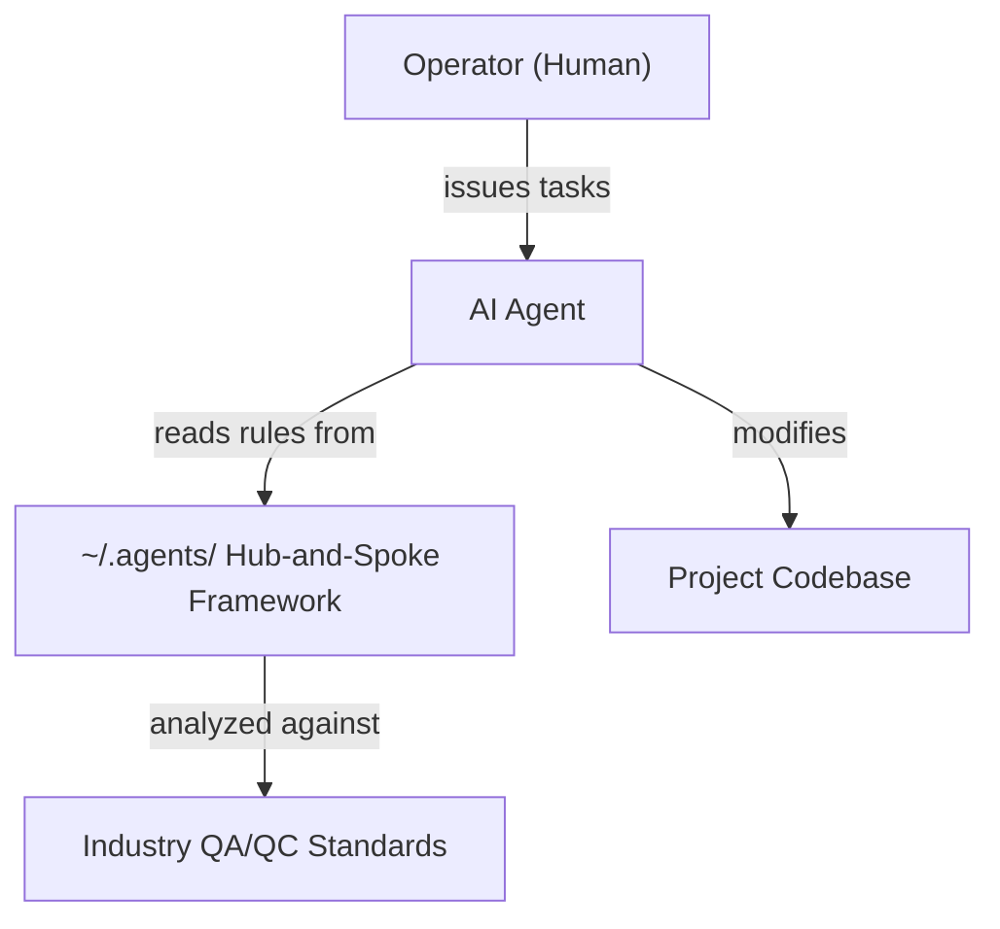

# Architecture

This project is a documentation and analysis artifact. It has no runtime components.

## C4 System Context

The system under analysis is the `~/.agents/AGENTS.md` hub-and-spoke framework — a set of markdown documents that govern AI agent behavior during software engineering tasks.

## Technical Stack

This project is pure documentation:
- **Format:** Markdown with Mermaid.js diagrams
- **Version Control:** Git
- **Validation:** `mmdc` for diagram verification, markdownlint for prose
